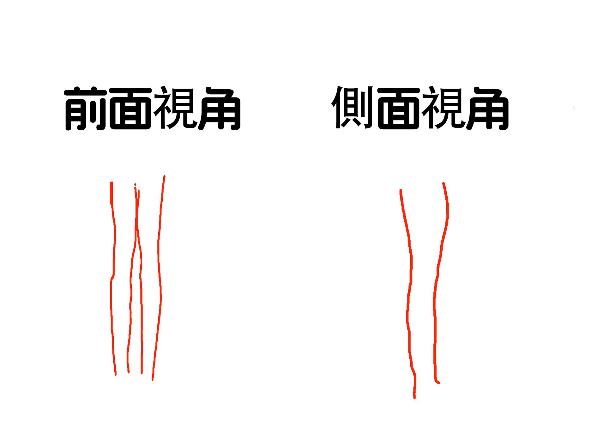

# 腿部線條

## 概述

因為跨性別女性在RLE過程中，有穿女裝的需求，例如：超短褲、裙子等，這樣的衣服要穿的好看就需要有一個**線條柔和**的腿部

## 線條

請看以下示意圖：

如圖所示

- **在前面視角**，腿部在大腿至小腿關節處，大腿外側有一定的斜度，而內側則為直線型，小腿外側稍微突出成弧形，再到腳踝成直線型，內側則為直線型
- **在側面視角**，後側大腿到關節處有一定的斜度，小腿下面成弧形，前側，大腿至關節處成弧形，小腿成直線型

## **如何形成這樣的線條（如何從大象腿逆襲）**

### 大腿：

如果大腿是肉肉比較多的話，可以平躺在床上（**記得腰部墊個枕頭**），腿抬起來做開合運動，這樣可以有效燃燒大腿部位的脂肪（**可能會很難受**，但做多幾次就可以了，**前幾次腿伸不直很正常**，**腿只要有點抽筋的感覺就是可以的了**），一天兩次，每次30秒

### 小腿：

**有氧運動**：如慢跑、快走等，有助於消耗小腿脂肪

**瘦腿捏揉法**：沐浴後塗抹纖體服液，用雙手拇指、食指和中指揉搓小腿肌肉群

**筋膜槍放鬆**：使用筋膜槍按摩小腿，可以放鬆肌肉，使腿部肌肉視覺上變得修長

**小腿做完運動一定要放鬆訓練，不然就會越來越粗**

### 小腿外翻處理：

**姿勢調整**：保持正確的站立和行走姿勢，避免外八字或內八字行走，長時間站立或行走後適當休息，避免腿部肌肉過度緊張。選擇有良好足弓支撐的鞋子，減少對小腿的不良影響

**功能鍛煉**：通過特定的鍛煉來增強小腿內側肌肉群的力量，如靠墻站立、蹲起運動、平板支撐等，有助於改善小腿肌肉的不平衡狀態。進行腿部和髖關節的柔韌性訓練，如瑜伽中的腿部拉伸動作，可以增加關節的靈活性，進一步促進外翻的矯正

**佩戴矯正器具**：對於青少年患者，若骨骺尚未完全閉合，可以通過佩戴矯形支具來矯正小腿外翻。矯形支具需要根據患者的具體情況進行定制，並在專業醫生的指導下佩戴和使用

**物理治療**：在專業按摩推拿醫師的指導下進行手法矯正，通過按摩和推拿來松弛膝關節外側的副韌帶，促進膝關節內外側的穩定結構恢覆。電療和熱療則可以緩解肌肉緊張，促進血液循環，對矯正小腿外翻有一定的輔助作用

**手術治療（不建議）**：對於成年患者或外翻程度非常嚴重的患者，可能需要在專業醫生的指導下進行手術治療。手術通過截骨並重新固定骨骼，以糾正小腿外翻的畸形，術後需要按照醫生的指導進行規範的康覆訓練，以促進恢覆和避免並發癥

**生活方式的調整**：改善日常生活中的不良習慣也是矯正小腿外翻的重要一環。選擇合適的鞋子，避免高跟鞋或過於緊窄的鞋子，保持正確的坐姿和站姿，都是有助於減緩小腿外翻的措施。適當的體重管理也可以減輕腿部的負擔，從而改善小腿的形態

## 心理支持

在這個過程中可能會很艱難，但是一定不要放棄，在將來不遠的一天妳會成功，如果有人說妳妳就記住這句話：**莫聽穿林打葉聲，一蓑煙雨任平生 -蘇軾《定風波》**

